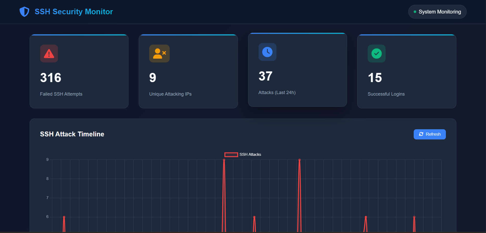
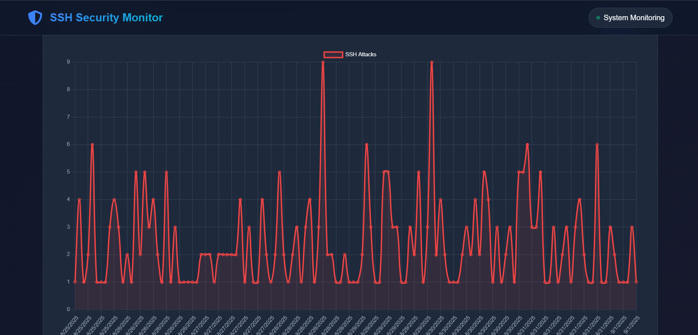
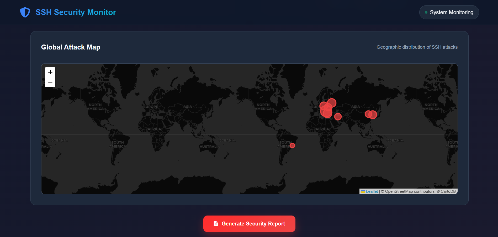
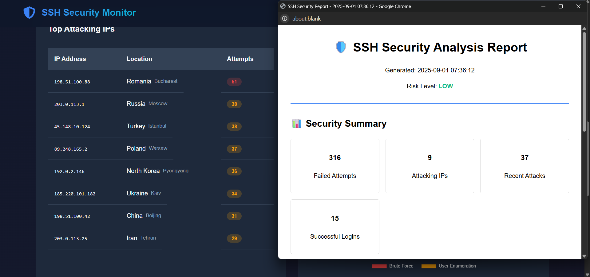

# 🛡️ SSH Security Monitor


A comprehensive SSH security monitoring and threat detection system that analyzes log files, identifies attack patterns, and generates professional security reports. Built with Python Flask and modern web technologies.

## 🎯 **Key Features**

### 🔍 **Real-time Threat Detection**
- **SSH Attack Monitoring**: Detects failed login attempts, brute force attacks, and user enumeration
- **IP Geolocation**: Maps attacking IPs to their geographic locations  
- **Attack Pattern Analysis**: Identifies suspicious patterns and repeat offenders
- **Real-time Dashboard**: Live monitoring with automatic data refresh

### 📊 **Advanced Analytics**
- **Interactive Charts**: Timeline analysis using Chart.js visualizations
- **Attack Statistics**: Comprehensive metrics and trend analysis  
- **Top Attackers Table**: Ranked list of most active threatening IPs
- **Global Attack Map**: Geographic visualization using Leaflet maps

### 📋 **Professional Reporting**
- **Security Reports**: Comprehensive PDF-ready security analysis reports
- **Risk Assessment**: Automated threat level evaluation (Low/Medium/High)
- **Security Recommendations**: Expert guidance for system hardening
- **Executive Summaries**: Business-ready security briefings

## 🚀 **Live Demo**

**🌐 [View Live Demo](https://ssh-security-monitor.onrender.com)**

*Experience the full dashboard with sample data demonstrating real SSH attack scenarios*

## 🛠️ **Technology Stack**

- **Backend**: Python 3.8+, Flask web framework
- **Frontend**: HTML5, CSS3, JavaScript (ES6+)  
- **Visualization**: Chart.js for interactive charts, Leaflet for maps
- **Styling**: Modern CSS Grid/Flexbox, responsive design
- **Deployment**: Render cloud platform
- **Version Control**: Git & GitHub

## 📸 **Screenshots**

### Main Security Dashboard


### Attack Timeline & Analytics  


### Geographic Attack Map


### Security Report Generation


## 🏃‍♂️ **Quick Start**

### Prerequisites
- Python 3.8 or higher
- pip package manager
- Git (for cloning)

### Installation

1. **Clone the repository**
```bash
git clone https://github.com/TheGhostPacket/ssh-security-monitor.git
cd ssh-security-monitor
```

2. **Create virtual environment**
```bash
python -m venv venv
source venv/bin/activate  # On Windows: venv\Scripts\activate
```

3. **Install dependencies**
```bash
pip install -r requirements.txt
```

4. **Run the application**
```bash
python app.py
```

5. **Open your browser**
```
Navigate to: http://127.0.0.1:5000
```

## 🔧 **Configuration**

### Sample Data vs Real Logs

**For Development/Demo** (Current Implementation):
- Uses realistic sample SSH log data
- Perfect for portfolio demonstrations
- No system dependencies required
- Safe for deployment and sharing

**For Production Use**:
```python
# In ssh_analyzer.py, modify the __init__ method:
def __init__(self, log_file_path="/var/log/auth.log"):
    self.log_file_path = log_file_path
    self.parsed_logs = self.parse_real_logs()
```

### Real SSH Log Integration
```python
def parse_real_logs(self):
    """Parse actual SSH logs from system"""
    with open(self.log_file_path, 'r') as file:
        return self.parse_logs(file.readlines())
```

## 📊 **Features Deep Dive**

### Security Metrics Tracked
- **Failed SSH Attempts**: Total count of unsuccessful login attempts  
- **Unique Attacking IPs**: Number of distinct threat sources
- **Attack Frequency**: Time-based attack pattern analysis
- **Geographic Distribution**: Country/city-level threat mapping
- **User Enumeration**: Detection of username discovery attempts
- **Success Rate Analysis**: Login success vs failure ratios

### Attack Detection Capabilities
- **Brute Force Attacks**: Rapid-fire password attempts from single IPs
- **Distributed Attacks**: Coordinated attacks from multiple sources  
- **User Enumeration**: Attempts to discover valid usernames
- **Persistence Tracking**: Long-term attacker behavior analysis
- **Anomaly Detection**: Unusual patterns indicating sophisticated threats

### Reporting & Alerting
- **Executive Reports**: High-level security summaries for management
- **Technical Analysis**: Detailed logs and forensic information
- **Risk Scoring**: Automated threat level assessment
- **Trend Analysis**: Historical attack pattern identification  
- **Remediation Guidance**: Specific security recommendations

## 🔒 **Security Best Practices Demonstrated**

This project showcases understanding of:

- **Log Analysis**: Parsing and interpreting system security logs
- **Threat Intelligence**: Geographic and behavioral threat analysis  
- **Risk Assessment**: Automated security risk evaluation
- **Incident Response**: Real-time threat detection and alerting
- **Security Reporting**: Professional security documentation
- **System Hardening**: SSH security configuration recommendations

## 📈 **Portfolio Value**

**Perfect for cybersecurity portfolio because it demonstrates:**

✅ **Linux System Administration**: SSH log analysis and system monitoring  
✅ **Security Analysis**: Threat detection and pattern recognition  
✅ **Data Visualization**: Complex security data presented clearly  
✅ **Full-Stack Development**: Complete web application with backend/frontend  
✅ **Professional Reporting**: Business-ready security documentation  
✅ **Real-world Application**: Addresses actual cybersecurity challenges  

## 🚀 **Deployment**

### Render Deployment
1. **Fork this repository**
2. **Connect to Render**: Link your GitHub account  
3. **Create Web Service**: Select this repository
4. **Environment**: Python 3
5. **Build Command**: `pip install -r requirements.txt`
6. **Start Command**: `gunicorn app:app`
7. **Deploy**: Automatic deployment from GitHub

### Environment Variables
```bash
# Optional: Set custom configuration
FLASK_ENV=production
PORT=5000
```

## 🤝 **Contributing**

Contributions welcome! Areas for enhancement:

- **Real GeoIP Integration**: Replace mock location data with actual GeoIP database
- **Alert System**: Email/SMS notifications for high-risk events  
- **Machine Learning**: AI-powered anomaly detection
- **API Integration**: Connect with SIEM systems
- **Mobile App**: iOS/Android companion application
- **Advanced Forensics**: Detailed attack reconstruction

### Development Setup
```bash
# Install development dependencies
pip install -r requirements-dev.txt

# Run tests
python -m pytest

# Code formatting  
black ssh_analyzer.py app.py
```

## 📜 **License**

This project is open source and available under the [MIT License](LICENSE).

## 👨‍💻 **Author**

**TheGhostPacket** - Cybersecurity Enthusiast & Full-Stack Developer

- **Portfolio**: [theghostpacket.com](https://theghostpacket.com)
- **GitHub**: [@TheGhostPacket](https://github.com/TheGhostPacket)  
- **LinkedIn**: [Nhyira Yanney](https://linkedin.com/in/nhyira-yanney-b19898178)
- **Email**: contact@theghostpacket.com

## 🙏 **Acknowledgments**

- **SSH Security Community**: For attack pattern research and best practices
- **OpenStreetMap**: Geographic data for attack visualization
- **Chart.js & Leaflet**: Excellent visualization libraries  
- **Flask Community**: Robust web framework documentation
- **Cybersecurity Researchers**: Threat intelligence and analysis techniques

---

**⭐ If this project helped you learn about SSH security monitoring, please give it a star!**

*Building secure systems, one log entry at a time* 🛡️